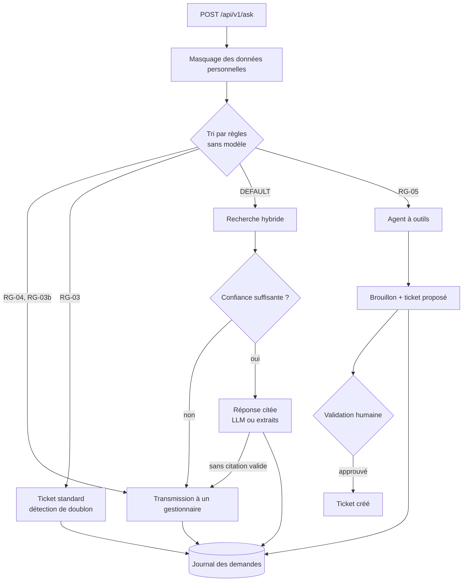

# 3. Architecture

## Parcours d'une demande

`services/ask.py` porte ce parcours : masquage, tri, appel de la voie, écriture d'une
ligne dans le journal des demandes. C'est aussi le seul endroit où une erreur inattendue
d'une voie est rattrapée et transformée en transmission à un gestionnaire.

## Composants

| Composant | Rôle | Fichiers |
|---|---|---|
| API | Routes HTTP, clé d'API, limite de débit, identifiant de requête, contrôles de santé | `main.py`, `api/routes.py`, `core/security.py` |
| Tri | Extraction du client et du montant, règles ordonnées | `agents/extract.py`, `agents/triage.py` |
| Ingestion | Lecture Markdown, texte, PDF (page par page) et e-mail ; découpage par titres et paragraphes ; index | `ingestion/` |
| Recherche | BM25, embeddings, stockage des vecteurs, fusion des deux classements | `retrieval/bm25.py`, `embeddings.py`, `vector_store.py`, `hybrid.py` |
| Réponse documentaire | Contrôle de confiance, rédaction par modèle ou extraits, contrôle des citations | `retrieval/rag.py`, `core/guardrails.py` |
| Agent | Boucle LangGraph à deux nœuds, quatre outils, plan de repli sans modèle | `agents/dossier_agent.py`, `agents/tools.py` |
| Validation | Approbation ou refus d'un ticket proposé | `services/actions.py` |
| Client LLM | Un point d'entrée pour tous les fournisseurs (LiteLLM), coût calculé sur les tokens réels | `core/llm.py` |
| Données | Tickets, actions, journal des demandes, avis | `db/` |
| Interface | Formulaire, résultat, sources, validation, avis, indicateurs | `frontend/` |

## Recherche documentaire

À l'ingestion, chaque document est découpé en passages (900 caractères au plus, sans
couper une ligne de tableau), avec son titre, sa section, sa page et, pour un contrat,
le client auquel il appartient.

À la recherche :

1. **BM25** sur les radicaux des mots (titre, section et texte du passage) ;
2. **vecteurs** : similarité cosinus avec le modèle
   `paraphrase-multilingual-MiniLM-L12-v2`, exécuté localement (ONNX, via fastembed) ;
3. **fusion** des deux classements par rangs réciproques (RRF) ; les 4 meilleurs
   passages sont retenus.

Les passages d'un contrat sont exclus des deux recherches pour toute demande dont le
champ client ne désigne pas le client concerné. Un identifiant écrit dans le texte ne
suffit pas (voir [06-securite-rgpd.md](06-securite-rgpd.md)).

Deux stockages de vecteurs existent derrière la même interface : un fichier NumPy
(par défaut, sans infrastructure) et un serveur Qdrant (si `QDRANT_URL` est renseigné).
Si le modèle d'embeddings ou le stockage est indisponible, l'index est construit en
BM25 seul et l'ingestion le signale.

## Réponse documentaire

- **Confiance.** Part des termes de la question retrouvés dans les passages, combinée à
  la meilleure similarité vectorielle. Sous 0,35, la demande est transmise.
- **Avec un modèle.** Il reçoit la question masquée et les passages numérotés, et doit
  citer `[n]` ou répondre `INSUFFISANT`. Une réponse sans citation valide, ou coupée à
  la limite de tokens, n'est pas renvoyée.
- **Sans modèle.** Les phrases, éléments de liste et lignes de tableau des passages sont
  notés par recoupement de termes avec la question ; les un à trois meilleurs sont cités
  tels quels. Un passage doit partager au moins deux termes avec la question (en comptant
  le titre de sa section, l'en-tête de son tableau et le titre du document) ; sinon la
  demande est transmise.

## Agent

Deux nœuds : `plan` demande le message suivant au planificateur, `tools` exécute les
outils demandés, et la boucle s'arrête quand le planificateur rédige sa réponse ou au
bout de `AGENT_MAX_STEPS` tours.

| Outil | Effet |
|---|---|
| `search_docs(query)` | Recherche hybride, limitée au client du dossier |
| `get_contract()` | Formule, validité, astreinte du client du dossier |
| `compute_deadline(priority)` | Délai contractuel et échéance en heures ouvrées |
| `propose_ticket(subject, summary, priority)` | Enregistre une proposition ; ne crée rien |

Aucun outil ne prend d'identifiant client : ils agissent tous sur le client du dossier,
c'est-à-dire celui du champ client de la demande. Un modèle ne peut donc pas être amené
à lire le contrat d'un autre client. Si le client n'est cité que dans le texte, le
dossier est traité comme celui d'un client à confirmer, sans lecture de contrat.

Deux planificateurs partagent la boucle et les outils : un modèle (appels d'outils au
format OpenAI via LiteLLM), et un plan fixe sans modèle utilisé quand aucune clé n'est
configurée ou quand le modèle échoue.

La proposition de ticket est enregistrée en base (`actions`). `POST
/api/v1/actions/{id}/approve` crée le ticket, avec la priorité proposée ou celle que le
valideur indique à la place ; la prise de décision est une mise à jour conditionnelle,
de sorte que deux approbations simultanées ne créent qu'un ticket.

Sans modèle, la priorité proposée vient de quelques indices (urgence, sécurité, arrêt
total) : P1 s'ils sont présents, P2 sinon. C'est une estimation à confirmer, pas une
qualification.

## Modèles

| Tâche | Modèle par défaut | Paramètre |
|---|---|---|
| Réponse documentaire | `mistral/mistral-small-latest` | `RAG_MODEL` |
| Agent | `anthropic/claude-sonnet-5-5` | `AGENT_MODEL` |
| Juge de fidélité (évaluation) | `anthropic/claude-haiku-4-5` | `JUDGE_MODEL` |

Le tri n'utilise aucun modèle. Changer de fournisseur revient à changer un nom de modèle
LiteLLM et la clé correspondante.

## Données stockées

| Table | Contenu |
|---|---|
| `request_log` | Une ligne par demande : voie, règle, mode, question **masquée**, confiance, latence, tokens, coût, types de données masquées, erreur éventuelle |
| `tickets` | Tickets créés par automatisation ou après validation |
| `actions` | Propositions de l'agent et leur décision (qui, quand, motif) |
| `feedback` | Avis OK / KO et commentaire masqué, liés à une demande |

SQLite par défaut ; PostgreSQL via `DATABASE_URL`. Les tables sont créées au démarrage ;
il n'y a pas d'outil de migration.
